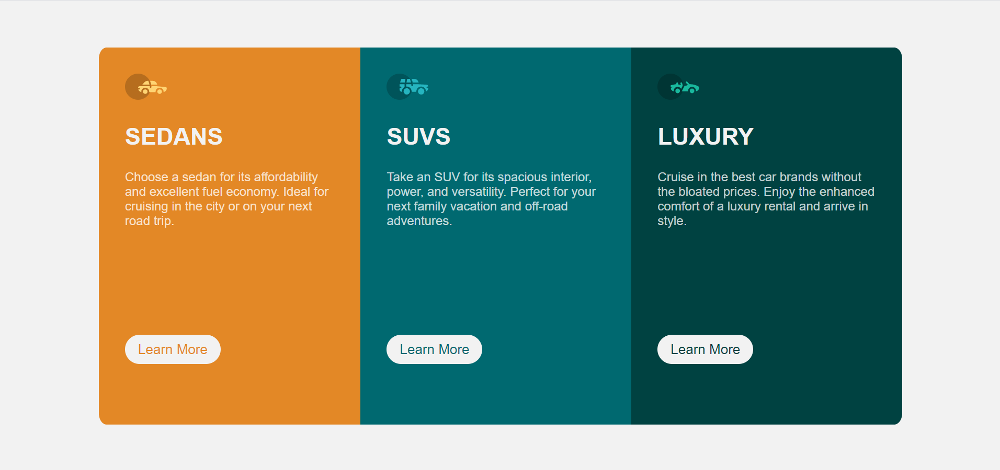

# Frontend Mentor - 3-column preview card component solution

This is a solution to the [3-column preview card component challenge on Frontend Mentor](https://www.frontendmentor.io/challenges/3column-preview-card-component-pH92eAR2-). Frontend Mentor challenges help you improve your coding skills by building realistic projects.

## Table of contents

- [Overview](#overview)
    - [The challenge](#the-challenge)
    - [Screenshot](#screenshot)
    - [Links](#links)
- [My process](#my-process)
    - [Built with](#built-with)
    - [What I learned](#what-i-learned)
    - [Continued development](#continued-development)
    - [Useful resources](#useful-resources)
- [Author](#author)
- [Acknowledgments](#acknowledgments)

**Note: Delete this note and update the table of contents based on what sections you keep.**

## Overview

### The challenge

Users should be able to:

- View the optimal layout depending on their device's screen size
- See hover states for interactive elements

### Screenshot




### Links

- Solution URL: [Will be added in the future](https://your-solution-url.com)
- Live Site URL: [Link](https://3-column-preview-ten.vercel.app/)
- GitHub Project URL: [Link](https://github.com/nikolasmatias/3-column-preview)

## My process

### Built with

- Semantic HTML5 markup
- CSS custom properties
- Flexbox
- Mobile-first workflow
- [Vue 3](https://v3.vuejs.org/) - JS library

### What I learned

In my [Last FrontendMentor Project](https://www.frontendmentor.io/solutions/reactjs-sass-flex-grid--mi9p_x9_)
a person told me about some tips I could use to improve my abilities in development of responsive applications.

In this small project I tried to apply this knowladge. In this case I tried to use just "witdh" and "height" in case of classes that would be used in my whole page.

For example:

```css
#app {
  height: 100vh;
  width: 100vw;
  display: flex;
  justify-content: center;
  align-items: center;
}

.vehicles {
  display: flex;
  flex-direction: row;
  justify-content: center;
  align-content: center;
  height: 80%;
  width: 80%;
}
```

But in some other cases I tried to use the power of css and the components alone to do this for me.

For this I just need to use font-sizes, paddings, margins, font-weight, among other options.

I had some good results with it. Just like the buttons, for example:

```css
.vehicle .section-button {
  background-color: var(--neutral-very-light-gray);
  padding: 10px 20px;
  border-radius: 50px;
  border: 0;
  font-size: 1.1rem;
  color: var(--primary-dark-cyan);
}
```

As you can see, I'm not using width or height. 
I'm just letting the paddings, border-radius and font-size do the hard work for me.

In the sense of responsiviness It's good cause everything will adapt for the new layouts and different screen sizes.

### Continued development

I'm studying a lot about new techniques I could use in my future projects
and I'm still trying to explore the new possibilities of css functionalities.

My main focus now is try to develop everything 
I can about th styles of the websites I'm doing without the need of use javascript for it.
I want to use javascript only when it's really needed.

## Author

- Frontend Mentor - [@NikolasMatias](https://www.frontendmentor.io/profile/NikolasMatias)
- LinkedIn - [@nikolas-matias-xavier-morais-180831a2](https://www.linkedin.com/in/nikolas-matias-xavier-morais-180831a2/)

## Acknowledgments


I was inspired by the response from [@grizhlieCodes](https://www.frontendmentor.io/profile/grizhlieCodes) on my last project. 
What he told me really guided me in this small project.